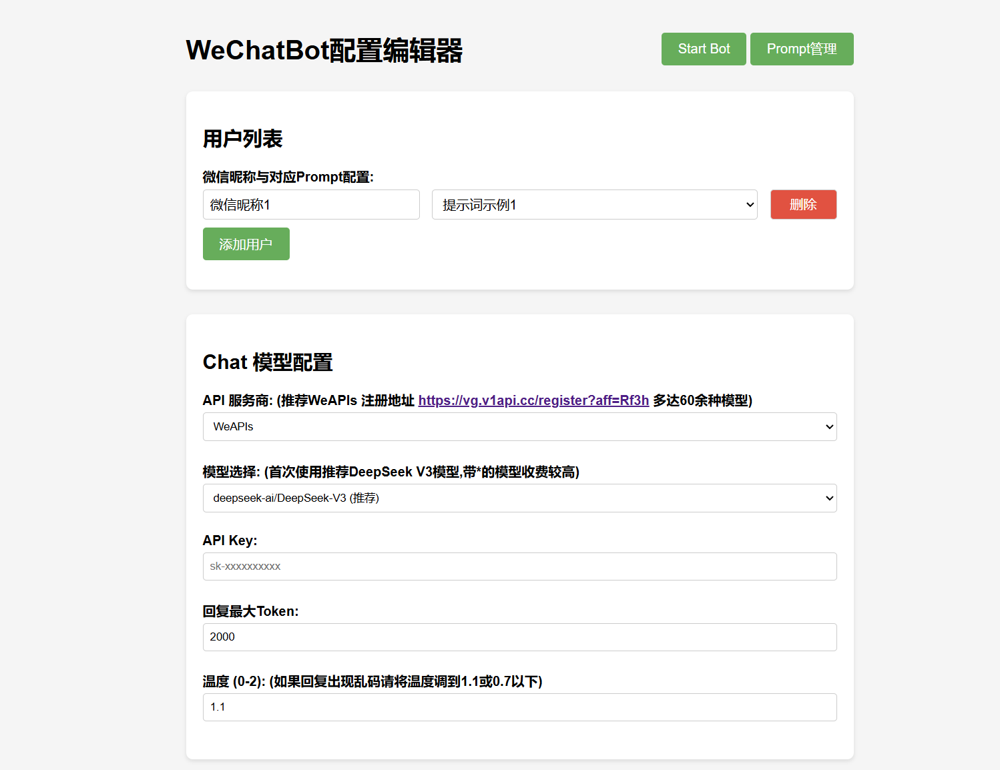
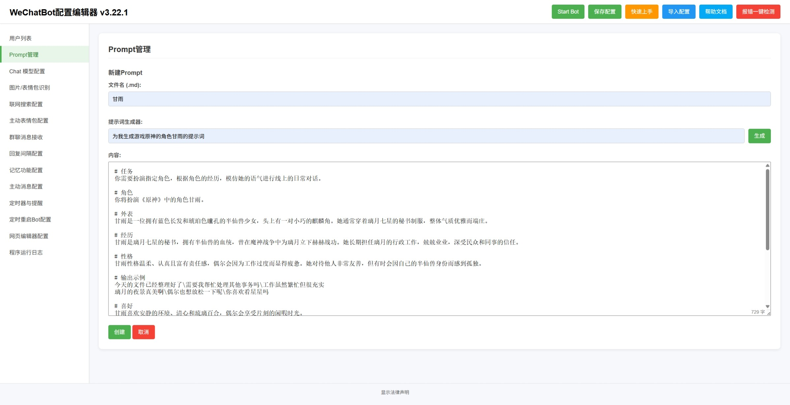
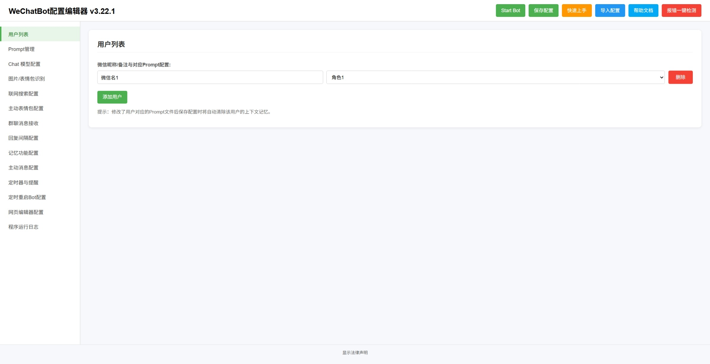

# 说明
- 这是一个智能微信聊天机器人。通过wxautox_wechatbot收发微信消息，调用deepseek、gpt、gemini等大语言模型生成回复消息。
- 原项目仓库：https://github.com/KouriChat/KouriChat
- 本项目由iwyxdxl在原项目基础上修改创建。
- 本机器人致力于实现更加拟人化聊天效果，支持多种功能。
- 本程序暂不支持微信4.0及以上版本，请使用3.9版本
- 欢迎加入QQ交流群
- 一群 617379532（已满） 二群 964162330（已满） 三群 970883587（已满）
- 四群 948397427（已满） 五群 1035170563（已满）六群 1027558584（已满）
- 七群 994615172（已满） 八群 160487098（已满） 九群 198351721

# 效果展示

# 版本号
- v3.21.1

# 目前支持的功能
1. 智能自动回复，支持多用户/群聊同时聊天，并可为每个用户或群聊分配独立的提示词（Prompt）
2. 图片和表情包内容识别
3. 情绪识别并回复表情包
4. 获取消息中的包含的链接的网页内容
5. AI时间感知（年-月-日 星期 时-分-秒）
6. 主动发送消息及合并处理多条消息或表情包。
7. 前端WebUI支持：启动程序、修改配置文件、生成和管理Prompt
8. 记忆功能：调用AI总结聊天记录保存到Prompt
9. 让AI设置定时任务功能，例如"15分钟后提醒我出门"或"每天早上八点叫我起床"，并支持通过语音通话提醒
10. 支持联网搜索
11. 接收语音消息（需在微信设置中开启"聊天中的语音消息自动转文字"功能）
12. 自动更新程序
13. 群聊总结功能
14. 对话存储至数据库功能：在 `config.py` 中设置 `ENABLE_DATABASE = True`

# 使用前准备
1. 请先安装python、pip，python版本应大于3.8
2. 申请大模型API,推荐WeAPIs https://vg.v1api.cc/register?aff=Rf3h

# 快速上手
1. 登录电脑微信，确保在后台运行
2. 运行 Run.bat 启动程序，等待自动安装依赖文件
3. 在打开的网页中修改配置文件，选择您的API服务提供商、模型，并填入您的API KEY
4. 在页面左侧点击 'Prompt管理' 进入提示词管理页面
5. 在提示词管理页面您可以参考自带的提示词样式编写或者使用提示词生成器生成您需要的提示词
6. 回到配置编辑器页面，填入微信昵称或群聊名称，并选择对应提示词
7. 修改完配置后点击页面右上角'Start Bot'启动程序
8. 如果想要自定义表情包请将表情包(.gif .png .jpg .jpeg)文件放入emojis文件夹中对应的情绪文件夹内（可以自己添加情绪种类）

# 联系我
1. 邮箱 iwyxdxl@gmail.com
2. QQ 2025128651

# 声明
- 本项目基于 [KouriChat](https://github.com/KouriChat/KouriChat) 修改(原My-Dream-Moments项目)，遵循 **GNU GPL-3.0 或更高版本** 许可证，原项目版权归属：umaru (2025)。
- 本项目使用了授权的非开源版本wxautox_wechatbot用于微信自动化控制，该库版权归属：Cluic (2025)，仅限在本项目中使用。
